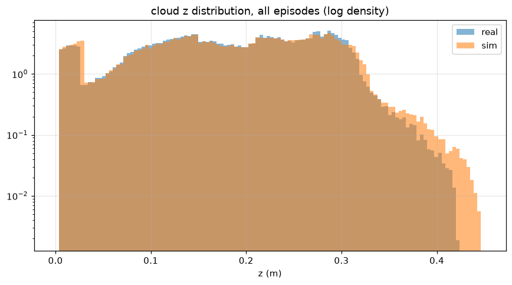
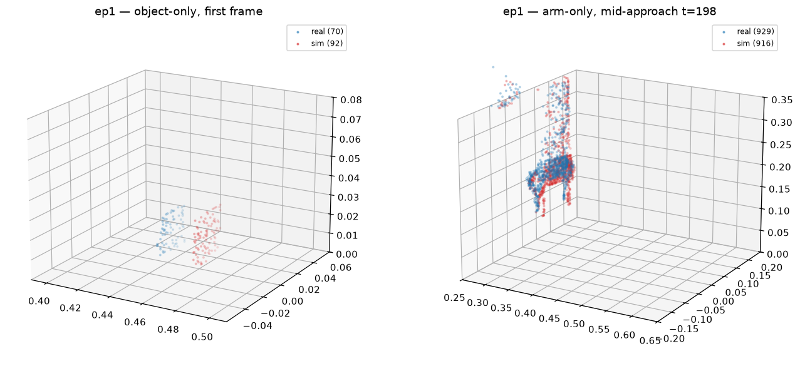
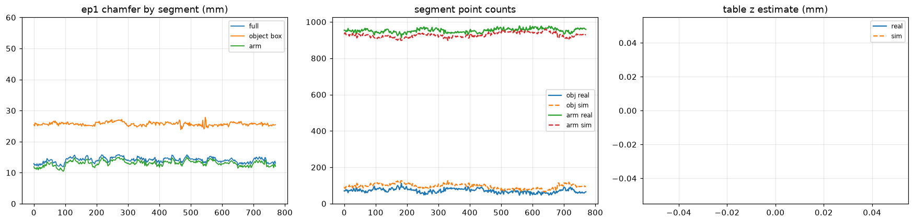
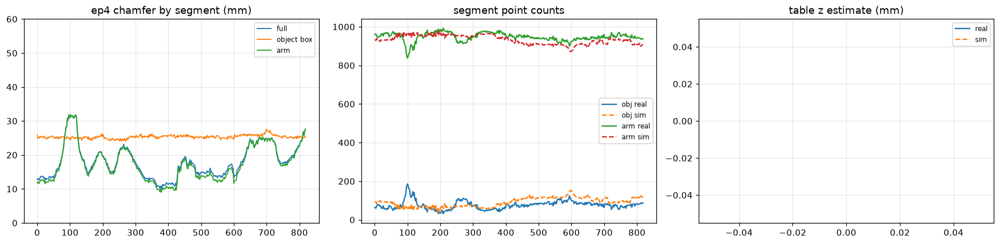

# Item 1 — sim-vs-real data difference on the paired cube3 probe (2026-08-23)

**Datasets.** Real: `dataset/demos/single_lift_cube3_real/26-08-23-oso` (5 teleop episodes,
3 cm cube placed right below the arm, armfocus obs, delta fast_rot actions, RGB videos).
Sim twin: `dataset/demos/single_lift_cube3_rigid/26-08-23-oso` — the SAME actions replayed
open-loop by `gentle_manip/scripts/replay_real_to_sim_paired.py` (cube at the real
first-frame TCP xy, sim home Cartesian-matched, obs/action processing taken from the real
recording's own `config.yaml`). Episode i / step t is the same commanded state in both pkls,
so any observation difference IS the sim2real data gap. Analysis script:
`examples/sim2real_diagnose/item1_cube3_gap_analysis.py` (local, uncommitted per convention);
raw outputs in `examples/sim2real_diagnose/figures/item1_cube3/summary.yaml`.

**Pairing quality (proprio, from `match_report.yaml` in the sim-twin dir).** EE position
1.1–1.8 mm mean / ≤10.2 mm max; gripper ≤0.6 mm; quat 1.0–1.6° mean, except ep4's 3.1° —
its fast late-episode yaw teleop exposes the real servo's ROTATION lag vs sim IK (drifts to
~8–15° in the final quarter while positions stay ≤1.8 mm). Rotation execution is the weakest
tracking channel of the real arm.

## What the policy's cloud actually contains

The record-time armfocus pipeline leaves the 1024-pt cloud **~93 % arm**: z quartiles
[0.26, 0.28, 0.30] m, only ~60–90 points below 5 cm — the cube plus a small table patch
immediately around it. **No far-field table survives** the crop+focus+FPS budget, in either
domain (identical pipeline by construction). "Table" is therefore not a segment the policy
sees; the analysis segments are **object** (static xy box around the spawn, z ≤ 6 cm — the
ceiling excludes the gripper hovering directly above, which is the probe protocol itself)
and **arm** (everything else above 1.5 cm; statistics restricted to pre-close frames so the
grasped cube never contaminates them).

## Gap decomposition (the headline result)

Per-frame symmetric chamfer and mean real→sim nearest-neighbour displacement vectors:

| segment | chamfer (mm, mean) | real→sim displacement (mm, x/y/z) |
|---|---|---|
| full cloud | 13.9–14.5 (ep4 18.1) | — |
| arm, pre-close | 12.7–13.8 (ep4 16.6) | **+9.0 / −1.6 / −1.0** (x range 8.0–10.8 across eps) |
| object box, pre-close | 24.6–25.9 | **+25.4 / −0.7 / 0.0** (x range 24.7–25.9) |
| full, after subtracting the arm bias | **8.4** (from 14.8) | — |

The **arm segment is proprio-pinned** (poses match to ~2 mm), so its systematic displacement
is a direct read of the real rig's **perception bias: ≈ 9 mm along −x** (the cam_ext viewing
ray — L515 depth over-read and/or residual extrinsic error; y/z are ≤2 mm). The object's
25 mm displacement then decomposes:

- **~9 mm = perception bias** (same as the arm; cross-checked in ep5, where the sensed cube
  sat ~7.5 mm −x of the EE close position that physically centred on it);
- **~16 mm = physical placement offset** — the cube was placed "below the arm" by eye, and
  actually sat ~1.6 cm toward the robot base from the TCP's ground projection.

One rigid translation (the arm bias) explains **43 % of the entire cloud gap** (14.8 →
8.4 mm). The residual ~8 mm is diffuse: sensor noise, real-vs-URDF gripper shape, and cube
appearance differences (below).

## Secondary findings

- **z is healthy.** Cube top face: real median 23.7–24.8 mm vs sim 26.2–26.3 mm (true top
  31 mm; both read low at the L515's grazing elevation, real ~2 mm lower than sim). Local
  table patch: real 6.9–8.6 mm vs sim 8.7 mm. The historical ~6–11 mm table-z extrinsic
  offset is NOT present in this recording (both clouds are floor-censored by the crop's
  z_min 4 mm, so sub-4 mm offsets are unobservable — but nothing like the old offset shows).
- **Real cube is sparser, but the shape matches.** 58–70 object points vs sim's 92, and a
  thinner top face (9–16 vs 27 pts): L515 dropout on a small object at grazing incidence.
  Real extents also flutter ep-to-ep (x 28–51 mm) where sim is constant at 51 mm (unstable
  silhouette). After removing the 25 mm translation, the object chamfer drops to roughly
  the noise floor — the object-region difference is POSITION + SPARSITY, not geometry.
- **Rigid physics replays even accidental contact.** In ep1 the operator pushed the cube
  ~7 cm before grasping; the open-loop sim twin reproduced the push to **3 mm** final
  position. ep2/ep5 pushes diverged 20–24 mm (contact-outcome sensitivity) — still the same
  qualitative behaviour. (ep4 figure shows the worst-case episode:
  )
- **Real servo rotation lag** (ep4, above) is an execution-side gap: commanded rotations
  arrive late/slow on the real arm relative to sim IK.

## Implications / actions

1. **The ~9 mm −x perception bias is correctable today**: the deploy/record configs already
   carry a `point_cloud_shift` knob (currently zero) — setting x ≈ +0.009 m (or an extrinsic
   recalibration, xy not just z) would align real clouds with sim-trained expectations. At
   3 cm object scale, 9 mm is a third of the object — plausibly material for precise grasps.
2. **Placement protocol**: for future paired probes, register the cube by jogging the TCP
   onto it (not by eye) — the ~16 mm placement term would vanish and the probe would read
   pure perception.
3. **Item 16 (paired-feature regularization)** gets exactly the right data: the dominant
   real-sim difference is a small, near-constant local translation plus point dropout —
   the kind of nuisance variation a feature-consistency loss should teach the encoder to
   ignore.
4. **Item 2 relevance**: the rotation-lag observation says scripted-demo rotation speeds
   should not exceed what the real servo tracks (already bounded by the rate-limit work).
